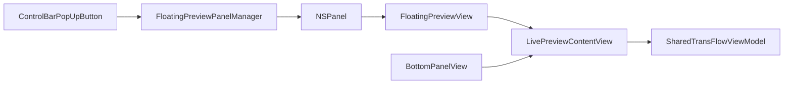

# 015 - Floating Live Preview (Agent Spec)

## Background

Users need a detachable live preview window for transcription so they can keep live text visible while using other apps.

Original request (`raw.md`): open a floating window that shows live transcription content.

## Goal

Add a `Pop Up` action from the main transcription UI that opens a draggable floating window.  
The floating window must support:

- easy close
- pin/unpin (always-on-top toggle)
- live sync with the same transcription state shown in the main window

## Scope

### In scope (implemented)

- Keep existing bottom preview in place.
- Add reusable live preview component used by both main window and floating window.
- Add AppKit-backed floating panel manager (`NSPanel`) with show/close/pin lifecycle.
- Add floating preview window UI with toolbar controls (`Pin`, `Close`).
- Add `Pop Up` button in control bar.
- Add i18n keys in `Localizable.xcstrings` for `en` and `zh-Hans`.
- Ensure build passes.

### Out of scope (for later UI iteration)

- Liquid Glass / transparent visual style polish.
- Advanced panel chrome customization and refined visual hierarchy.
- Persisting panel pin/open state across app relaunch.

## User Experience Requirements

### Main entry point

- In the transcription screen control bar, user can click `Pop Up Preview`.

### Floating window behavior

- If no floating panel exists: create and show one.
- If panel exists: bring it to front and refresh content/theme/locale.
- Panel can be dragged anywhere on screen.
- User can close using:
  - standard macOS close button
  - in-panel close icon

### Pin behavior

- `Pin on top`: panel level becomes floating above other app windows.
- `Unpin`: panel returns to normal level.
- Pin state is runtime-only (reset when window closes).

## Architecture / Data Flow

- Single shared `TransFlowViewModel` instance is owned at app root and passed down.
- Both bottom preview and floating preview read from the same view model fields:
  - `currentPartialText`
  - `translationService.currentPartialTranslation`
  - `listeningState`

## File Map (Implemented)

- `TransFlow/TransFlow/Views/LivePreviewContentView.swift`  
  Reusable preview card + `TypingIndicatorView`.

- `TransFlow/TransFlow/Views/FloatingPreviewView.swift`  
  Floating window SwiftUI content; pin/close controls; embeds `LivePreviewContentView`.

- `TransFlow/TransFlow/Services/FloatingPreviewPanelManager.swift`  
  Owns `NSPanel`, show/close/pin logic, panel configuration.

- `TransFlow/TransFlow/TransFlowApp.swift`  
  Owns app-lifetime shared instances:
  - `TransFlowViewModel`
  - `FloatingPreviewPanelManager`
  - existing `AppSettings`

- `TransFlow/TransFlow/Views/MainView.swift`  
  Receives injected shared state/manager from app root.

- `TransFlow/TransFlow/ContentView.swift`  
  Uses injected manager/settings and reuses extracted preview view.

- `TransFlow/TransFlow/Views/ControlBarView.swift`  
  Adds `Pop Up` button to open/focus floating preview.

- `TransFlow/TransFlow/Localizable.xcstrings`  
  Added keys:
  - `control.pop_up_preview`
  - `floating_preview.title`
  - `floating_preview.pin`
  - `floating_preview.unpin`
  - `floating_preview.close`

## Panel Technical Contract

- Panel type: `NSPanel`
- Drag support: `isMovableByWindowBackground = true`
- Pinning:
  - pinned -> `level = .floating`
  - unpinned -> `level = .normal`
- Space/fullscreen behavior:
  - base: `.moveToActiveSpace`, `.fullScreenAuxiliary`
  - pinned additionally: `.canJoinAllSpaces`

## Acceptance Criteria

- `Pop Up` button is visible in transcription control bar.
- Clicking `Pop Up` opens a floating preview window.
- Floating preview content updates live while transcribing.
- Window can be dragged to arbitrary screen positions.
- `Pin` keeps window above other app windows.
- `Unpin` returns normal z-order behavior.
- Window can be closed from both standard close control and in-window close control.
- App builds successfully via `xcodebuild`.

## Follow-up Suggestions (UI polish pass)

- Implement transparent/Liquid-Glass style surface and toolbar treatment.
- Improve iconography and spacing for pin/close controls.
- Consider a compact mode and remembered window frame/state.
